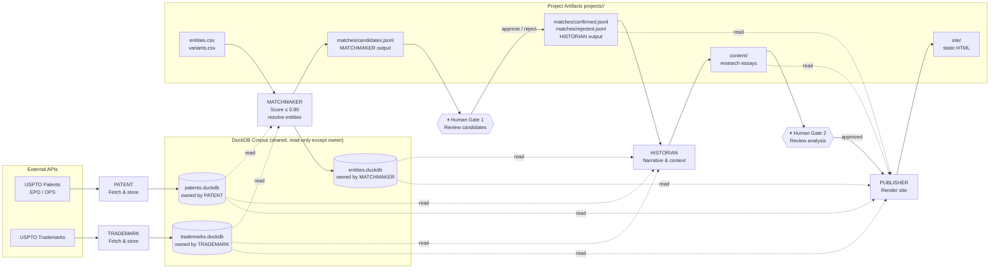
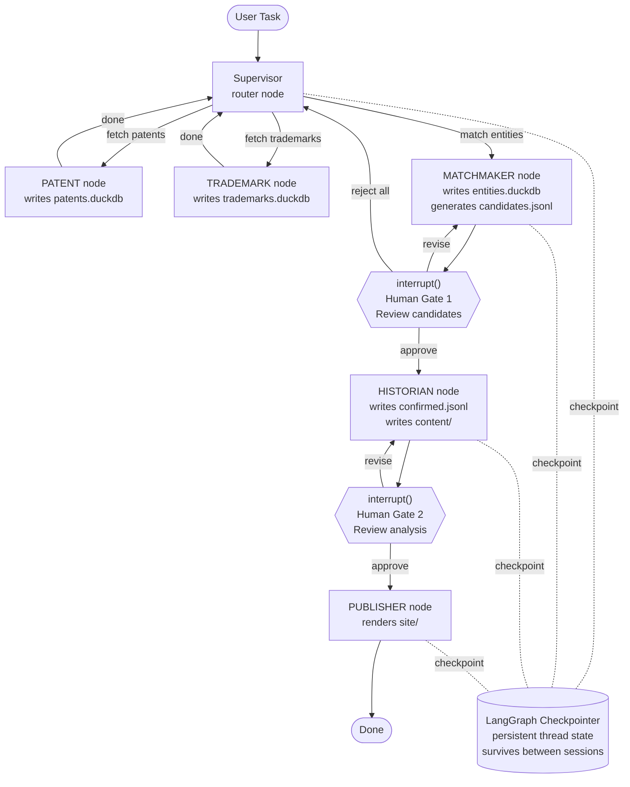
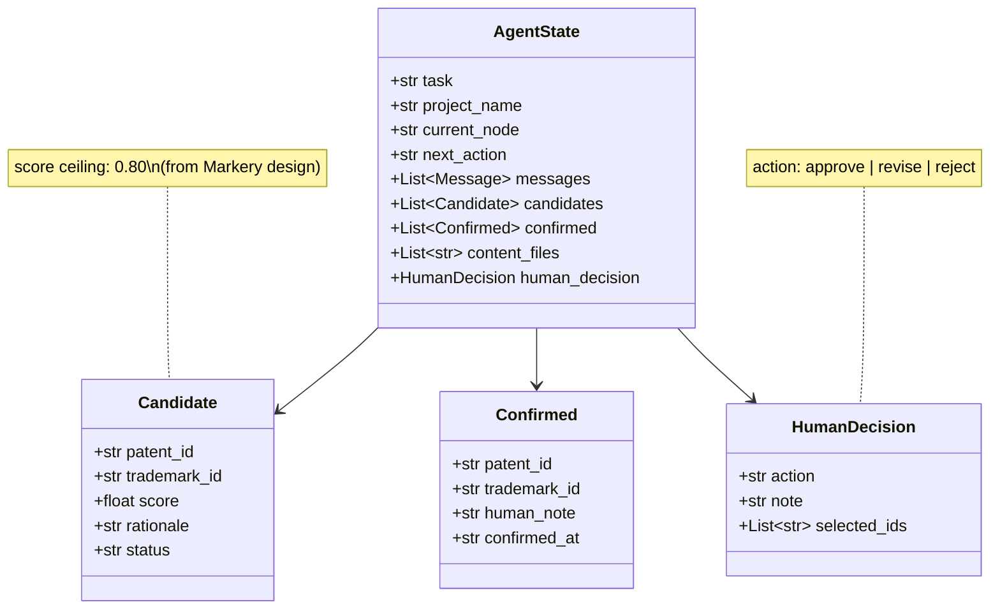

# GitHub Review — New Agent Repo (LangGraph companion)

This document records the strategic review of a proposed companion repo to Markery
that demonstrates industry-standard agent orchestration (LangGraph + LiteLLM) over
the same patent/trademark domain. It includes an evaluation of an external AI review
(Grok) and architecture diagrams produced from that evaluation.

---

## Evaluation of the Concept and the Grok Guidance

### What the Concept Gets Right

The core strategic pivot is sound: the two existing repos already prove the ability
to build from scratch; a third project proving proficiency with industry harnesses
completes the portfolio triangle. Employers in 2026 want to see both — someone who
only knows LangGraph templates looks shallow, someone who only builds from scratch
looks unaware of production norms.

The LangGraph + LiteLLM stack is the right call. LangGraph's stateful graph model
maps directly onto the multi-specialist pattern already in Markery, which means the
work is translating a known architecture into a recognized framework — a stronger
story than a disconnected demo.

---

### Where the Grok Advice Needs Correction

**1. Model choice for the budget is wrong.**
`deepinfra/Qwen/Qwen3-235B-A22B` is a 235B-parameter MoE model. Even at DeepInfra's
rates, any active development workflow would blow past $40/month quickly. Better targets:

- Qwen3-8B or 14B on DeepInfra (~$0.07–0.15/M tokens) for routine steps
- Llama 3.3 70B on Groq — Groq has a free tier (rate-limited but usable for dev)
  that the Grok session did not mention at all
- Reserve stronger models only for final synthesis nodes

**2. The GitHub repo search is questionable.**
Several repos Grok cited (`yorkeccak/patents`, `mattshax/ipagent`,
`ASUCICREPO/Patent-Novelty-Assessment`) should be verified before depending on them.
LLMs hallucinate repo names confidently. Verify each one exists with the described
code before treating them as references.

**3. `langchain-litellm` package stability.**
The `langchain-litellm` package has had maintenance gaps. The more reliable path in
2026 is `litellm` directly plus `langchain_community.chat_models.ChatLiteLLM` — or
using LiteLLM's OpenAI-compatible proxy server and pointing LangGraph's
`init_chat_model` at it. Check current package health before committing.

**4. The harness framing at the end is correct but undersold.**
The `langgraph new` CLI recommendation is right. The key insight Grok danced around:
cloning official templates is not a shortcut, it is the job. A candidate who uses
`langgraph new`, understands every file it generates, and extends it purposefully
signals more maturity than one who rebuilds the same boilerplate from scratch.

---

### Relationship to Markery

The new project is not parallel to Markery — it is a different architectural layer
over the same domain:

- Markery: data collection pipeline, DuckDB storage, static site output, human
  confirmation at match scoring
- New project: intelligent agent orchestration layer, same patent/trademark domain,
  LangGraph-managed workflow, LiteLLM-routed inference

The specialist roles in Markery (`PATENT`, `TRADEMARK`, `MATCHMAKER`, `HISTORIAN`,
`PUBLISHER`) map nearly 1:1 to LangGraph nodes. The framing: "the agent orchestration
companion to my historical patent database pipeline" — two repos, complementary
layers, same domain expertise. That is a coherent technical story.

---

### Concrete Recommendations

| Priority | Action |
|---|---|
| First | Verify the GitHub repos Grok cited actually exist as described |
| Second | Use `langgraph new` with the official Python template; read every generated file before modifying |
| Third | Replace the default LLM with LiteLLM pointing at Groq free tier first, DeepInfra (small model) for anything needing more |
| Fourth | Wire one Markery-domain workflow (e.g., patent search → classification → report) through the LangGraph graph before adding agents |
| Fifth | Apply for Groq and DeepInfra free/startup tiers before spending anything |

---

### Bottom Line

The concept is strategically correct and the stack direction is right. The main gaps
in the Grok session were: budget math on model choice and the unmentioned Groq free
tier. The strongest move is treating the new repo as an explicit architectural layer
on top of Markery's domain, not a standalone project — that framing makes both repos
stronger simultaneously.

---

## Repo Architecture Decision — 2026-05-25

**Decision: new repo (`Markery-LangGraph`), shared data contract, no code dependency.**

Evaluated after Phase 14 closed and Phases 15–16 were planned.

### Options considered

| Option | Verdict | Reason |
|---|---|---|
| Fork of Markery | Rejected | Implies Markery was inadequate; muddies which is canonical; diverges immediately with no benefit |
| Monorepo subdirectory | Rejected | Dilutes the portfolio signal — the architectural contrast between CLI pipeline and LangGraph harness is the point; burying one inside the other collapses that contrast |
| New repo with pip dependency on Markery | Rejected | Tightly couples the repos; every internal Markery refactor risks breaking the LangGraph repo; would require refactoring Markery to expose a stable Python API before the companion can start |
| **New repo, shared data contract** | **Chosen** | Cleanest separation; each repo tells a complete story; the DuckDB schema and project directory conventions are the interface, not Python imports |

### What "shared data contract" means

The two repos operate against the same data files via shared path conventions. Neither imports the other's Python code. The contract is:

**DuckDB files** (read by both repos):
- `data/patents.duckdb` — schema documented in `src/markery/specialist/patent/`
- `data/trademarks.duckdb` — schema documented in `src/markery/specialist/trademark/`
- `data/entities.duckdb` — schema documented in `src/markery/specialist/matchmaker/`

**Project artifact files** (written by Markery-ICM, read by Markery-LangGraph):
- `projects/<name>/matches/candidates.jsonl` — one JSON record per candidate pair
- `projects/<name>/matches/confirmed.jsonl` — human-confirmed pairs
- `projects/<name>/matches/rejected.jsonl` — explicitly rejected pairs
- `projects/<name>/content/*.md` — research essays with YAML frontmatter
- `projects/<name>/entities.csv`, `variants.csv` — entity registry

**Library files** (written by LIBRARIAN in Markery-ICM, readable by both):
- `library/works/<slug>/excerpts.md` — curated passages
- `library/index.jsonl` — passage index
- `library/index.duckdb` — embedding vectors (Phase 15 P7)

### The portfolio story

Both repos should acknowledge the relationship explicitly in their READMEs:

- **Markery-ICM README:** "See also: Markery-LangGraph — the same domain implemented as a LangGraph agent graph with LiteLLM-routed inference, operating against the same DuckDB corpus."
- **Markery-LangGraph README:** "Companion to Markery-ICM — this repo demonstrates the same patent-trademark research pipeline implemented using industry-standard agent orchestration (LangGraph + LiteLLM). It reads from and writes to the same DuckDB files."

The contrast is the signal: one repo proves you can build infrastructure from scratch; the other proves you know how to use production harnesses.

### Implementation sequence

- **Phase 16** (Markery-ICM): PatentsView bulk import, Wikipedia Stage 4, documentation pass, code gap analysis.
- **Phase 17** (Markery-ICM): any changes Markery requires to make the shared data contract formal and stable — schema documentation, file format versioning, query interface hardening. This is Markery work done in service of Markery-LangGraph.
- **After Phase 17**: begin `langgraph new` in the new repo. Wire one workflow (patent search → classification → report) through the graph before adding agents. The data contract defined in Phase 17 is the starting point.

### LIBRARIAN wrinkle

Phase 15 adds a non-trivial acquisitions layer (IA/Gutenberg fetch, Claude-assisted extraction, sentence-transformers embeddings). When Markery-LangGraph adds a LIBRARIAN node, it will either reimplement that logic or the acquisition/embedding code will need extracting into a shared package (`markery-lib`). This is a Phase 18+ consideration — do not solve it before Markery-LangGraph exists and the duplication is real.

---

## Architecture Diagrams — LangGraph Mapping

These diagrams map Markery's specialist structure onto a LangGraph implementation.
They serve as the architectural foundation for the companion repo.

Render in any GitHub README, VS Code (Mermaid extension), or at mermaid.live.

---

### Diagram 1 — Full Pipeline

Data origins, specialist agents, human gates, and project outputs.

---

### Diagram 2 — LangGraph Node Graph

Routing logic, interrupt points, and checkpointer wiring.

---

### Diagram 3 — State Schema

The TypedDict state that flows through every node in the graph.

---

### Diagram Notes

- **Diagram 1** is for README readers — shows the full data flow end to end.
- **Diagram 2** is for developers — shows the LangGraph graph structure with interrupt points.
- **Diagram 3** is for code reviewers — shows the typed state contract shared across all nodes.
- The 0.80 score ceiling in `Candidate` preserves the intellectual-honesty constraint from Markery's matching design.
- Human gates map to LangGraph's `interrupt()` primitive, not external approval services.
